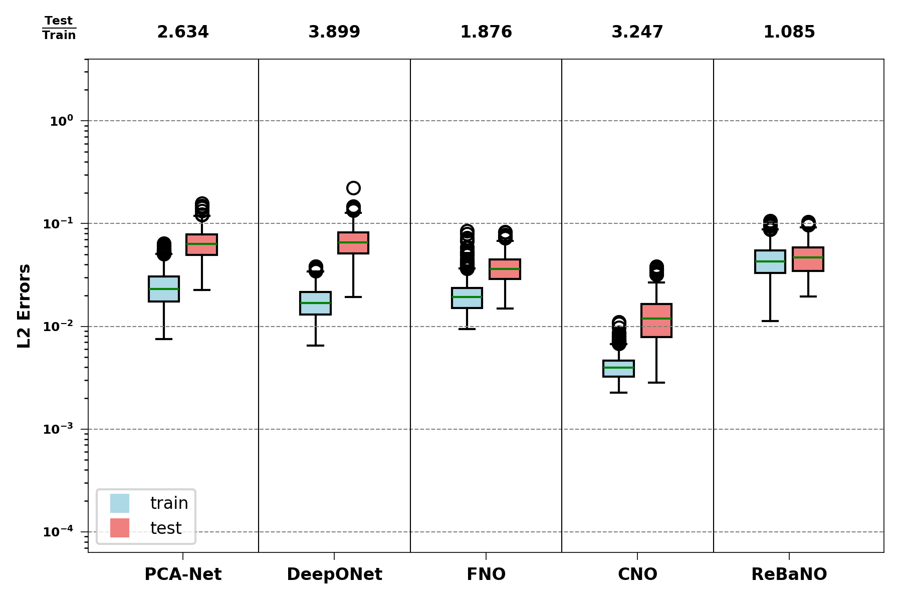

# ReBaNO: Reduced Basis Neural Operator Mitigating Generalization Gaps and Achieving Discretization Invariance

### Haolan Zheng<sup>1</sup>, Yanlai Chen<sup>1</sup>, Jiequn Han<sup>2</sup>, Yue Yu<sup>3</sup>

## Paper Link: [arXiv]()

<p align="center">
<br>
<em>ReBaNO architecture</em>
</p>

## Abstract:
<em>We propose a novel data-lean operator learning algorithm, the Reduced Basis Neural Operator (ReBaNO), to solve a group of PDEs with multiple distinct inputs. Inspired by the Reduced Basis Method and the recently introduced Generative Pre-Trained Physics-Informed Neural Networks, ReBaNO relies on a mathematically rigorous greedy algorithm to build its network structure offline adaptively from the ground up. Knowledge distillation via task-specific activation function allows ReBaNO to have a compact architecture requiring minimal computational cost online while embedding physics. In comparison to state-of-the-art operator learning algorithms such as PCA-Net, DeepONet, FNO, and CNO, numerical results demonstrate that ReBaNO significantly outperforms them in terms of eliminating/shrinking the generalization gap for both in- and out-of-distribution tests and being the only operator learning algorithm achieving strict discretization invariance. </em>


</sub></sub><sub>1</sup> Department of Mathematics, University of Massachusetts Dartmouth, North Dartmouth, MA. 2</sup> Flatiron Institute, New York, NY. 3</sup> Department of Mathematics, Lehigh University, Bethlehem, PA.</sub></sub><br>

## Requirements:
```
Python  = 3.10.14
NumPy   = 1.26.4
PyTorch = 2.4.0+cu124
```

## Advantages of ReBaNO:
1. No requirement for high-fidelity solutions;
2. Better generalizability;
3. Discretization invariance;

## Experiments:
ReBaNO is tested on three test problems: 1D Poisson, 2D Darcy flow and 2D Navier-Stokes. We compare the performance of the ReBaNO with four neural operators: PCA-Net, DeepONet, Fourier Neural Operator (FNO) and Convolutional Neural Operator (CNO). See below for the benchmarks on test problems of all models. 

<p align="center">
<br>
<em>model benchmarks on three test problems</em>
</p>

<p align="center">
<br>
<em>discretization invariance test on the Poisson problem</em>
</p>

<p align="center">
<br>
<em>the box plot of relative L<sup>2</sup> errors on Darcy flow problem </em>
</p>

## Codebase Structure:
All script files for the implementation of the ReBaNO are located in the folder `ReBaNO/` under the directory of each example folder (e.g., `Darcy/ReBaNO/`). Scripts for running neural operators PCA-Net, DeepONet and FNO reside in the folder `NO/` under each example folder. For CNO usage, see the files in the folder `CNO/`. Training data of input-output pairs can be generated by running the Julia script files `*_data_gen.jl`.  

## Usage:
To train ReBaNO, please run the script files 
```
*/ReBaNO/*_main.py
```
for example, run `Darcy/ReBaNO/D_main.py` to train the ReBaNO on Darcy flow problem.

To test the model, please run
```
*/ReBaNO/*_test.py
```

## Citation:


